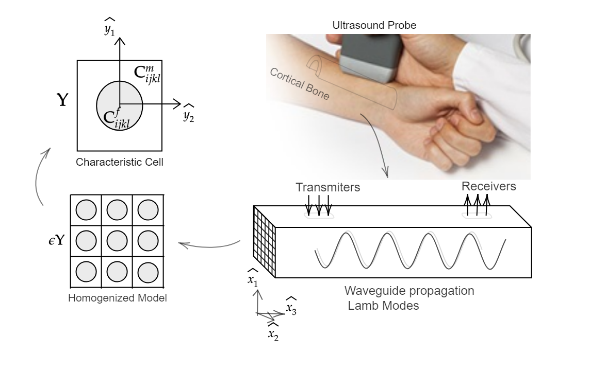

# Mesh Generation 
The usage of *Mathematical Modelling* to describe realistic behavior of bone is not new. Several work as been done during decades, concluded in several techniques such as Finite Difference Methods `FDM`, Finite Element Methods `FEM` Theory and applications and moreover, state-of-art softwares to tackle such discretized linear systems such as `FEniCS`, `Freefem`, etc.

## To have in mind...
A particular aspect to consider on industry-driven applications in the domain of simulations which defines of the main characteristic of the model itself being in various cases one of the main difficulties to describe adecuately.
In this direction, being part of my thesis at the University of Chile I was fascinated by such subject and created a algorithm-like procedure to recreate realistic bone mesh from micro-computed tomography images. 
Theoretical aspect regarding the mesh generation itself are not treated in this thread, nevertheless in the future will be addresses as the theory itself connected to `Tetgen` [^2] and `CGAL` [^1] softwares. 

The creation of such mesh procedure was necesary on the thesis project, since it was modelled realistic elastic and viscoelastic bone behavior on cortical bone. Schematically described by the below:

In this sense, a typical framework oriented to numerical simulations described from the image relates to the following:

* Homogenization Theory was applied on elastic/viscoelastic models associated to a microstructure characteristic of the cortical bone microstructure. [^3]

* Realistic simulations by FEM and *Newmark* discretization schemes was done to define the modelled physical behavior.

* Comparison to realistic experiment was assessed and moreover, prediction results was done.

## The Procedure
The procedure describes a 3-step wise creation method from computed-tomography images in which several layers of softwares are applied. Explicitly:
1. A step of scaling and tissue separation is done to retrieve relevant materials under study and moreover separate characteristic domain to mesh. Typical process is done by grayscale separation of tissues or machine learning techniques for clustering of pixels such as `K-means` to mention one.

2. A volumetric step is done, to describe the full domain to mesh, in this section characteristic of smoothness or convexity are studied and fixed whenever the case.

3. The usage of `iso2mesh`, `CGAL` softwares is applied which contains the computational geometric algorithms to mesh adequalety the volumetric domian, where is necessary to assess parameter values to correctly obtain meshes of the domain in correlation to the biomedical field in this case. [^1]

[^1]: Mesh Generated with state-of-art library [iso2mesh](http://iso2mesh.sourceforge.net/cgi-bin/index.cgi)
[^2]: Tetgen official website with mplementation [Hang Si](http://wias-berlin.de/software/tetgen/)
[^3]: A well-known expert in Homgogenization Theory Allaire [Allaire] (http://www.cmap.polytechnique.fr/)