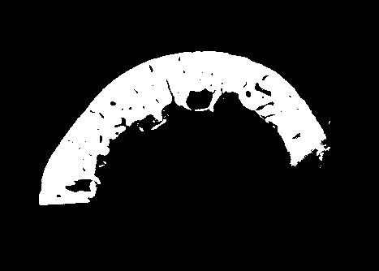

# Why I'm doing this?
If you have gone this far and found this blog..., or you know me or you are interested in very applied mathematics, hopefully I'll not dissapoint you! :).
This will be a series of small (well, maybe this is a lie...) posts regarding ultrasound methods for bone clinical measurements. In particular the studies I did during my thesis research (2018).

There will be lots of videos and images, so stay tune and reach me out!.

# Curiosities of Cortical Bone
*Man, this small part can be found in Journals, webpages, etc.* Cortical bone is a highly organized, hard and lightweight tissue, representing approximately 80% of the skeletal mass in a human adult. 

*Here is the cool part for the mechanicaly-oriented person* From a mechanical point of view, it can be defined as a two-phase composite material, a soft phase mainly of pores (containing organic fluids and soft tissues) and a complex hard phase mainly of hydroxyapatite with collagen.[^1]

The scale we are more interested in is the so-called **mesoscale** which contains the haversian canals and resorption cavities, that together provide the elastic behavior of the bone (as an emergent property).

The point of studying this material is related to the various parameters that can be recovered, such as microstructure, accumulated stress damage, collagen quality, etc. All of them revelant to the early diagnose of osteoporosis, *a condition leading to skeletal fragility and increasing risk of fractures*. [^2]

# Methods of Study
The early detection and prevention are active research lines. Here I mention just the most relevant:

* *Dual X-ray Absortiometry* (DXA) provides the *Bone Mineral Density* (BMD) used to diagnose osteoporosis, defining the gold-standard [^3].

* *X-ray Quanntitative Computed Tomography* (QCT) is used to assess volumetric bone density, but it's rather expensive with radiation costs involved.

* **The promising alternative**: *Quantitative Ultrasound Measurements* (QUS) a technique that overcomes the previous aspects, providing a lower cost, non-invasive and non-radiative novel methodology that reach the gold-standard in bounded tests. [^3].

[^1]: W. Parnell and I. Abrahams et al. [iso2mesh](https://www.researchgate.net/publication/222785482_Homogenization_for_wave_propagation_in_periodic_fibre-reinforced_media_with_complex_microstructure_I-Theory)
[^2]: J-G. Minonzio, N. Bochud, P. Laugier et al. [JG-Minonzio](https://www.ncbi.nlm.nih.gov/pubmed/30056165)
[^3]: J. Foiret, J-G. Minonzio, M. Talmant, P. Laugier et al. [Foiret](https://ieeexplore.ieee.org/document/6346132)